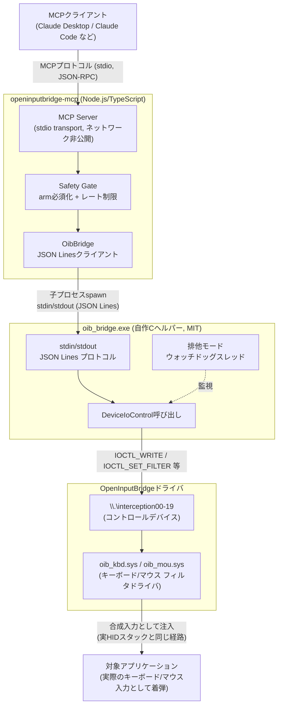

# OpenInputBridge-MCP

[](https://github.com/Applet-LLC/OpenInputBridge-MCP/actions/workflows/build.yml)

**[OpenInputBridge](https://github.com/Applet-LLC/OpenInputBridge)(Interception互換のカーネルレベル キーボード/マウス入力ドライバ)を、MCP (Model Context Protocol) 経由のツールとして公開するサーバーです。**

GUI/ネイティブアプリのテスト自動化における `SendInput()` / UI Automation / 座標ベース自動化ツールの代替・上位互換として、AIエージェント(Claude Codeなど)やテストコードから、カーネルレベルの合成キーボード/マウス入力を送信できます。

> ⚠️ 本プロジェクトは [oblitum/Interception](https://github.com/oblitum/Interception)(LGPL/商用デュアルライセンス)のコードには一切依存していません。ヘルパー実行ファイル(`helper/oib_bridge.c`)は、OpenInputBridge本体の [`docs/PROTOCOL.md`](https://github.com/Applet-LLC/OpenInputBridge/blob/main/docs/PROTOCOL.md) に文書化されたワイヤプロトコルのみを根拠に、独自にIOCTLを実装しています。

## これは何のためのツールか

`SendInput()` / UI Automation / PyAutoGUI・Selenium等の座標ベース自動化には、テスト自動化の現場でよく遭遇する構造的な限界があります。本ツールはそれらを、ドライバレベルで合成入力を注入することで回避します。

| よくある失敗パターン | 原因 | 本ツールでの解決 |
|---|---|---|
| 管理者権限で起動したアプリに入力が届かない | UIPI (User Interface Privilege Isolation) により、非管理者プロセスからの合成入力が上位integrity levelのウィンドウにブロックされる | カーネルドライバ層でHIDスタックに直接介在するため、送信元プロセスのintegrity levelに依存しない |
| RDP/仮想マシン/CI専用機で不安定 | 仮想ディスプレイやリモートセッションでは、`SendInput` が前提とするフォアグラウンドウィンドウ/デスクトップの扱いが環境依存になりやすい | ドライバはセッションが物理/仮想いずれであってもHIDスタック側で動作する |
| UI Automation/PyAutoGUIが解像度・DPI変更で壊れる | 画面座標やUI要素のプロパティに依存する | キーのメイクコード/マウスの相対移動量ベースで送信するため、解像度非依存 |
| 一部アプリが合成入力(`SendInput`由来)を区別・無視する | アプリによっては `SendInput` のフラグやRAW_INPUTの出自を見て弾く実装がある | 物理デバイスと同じ経路(`KEYBOARD_INPUT_DATA`/`MOUSE_INPUT_DATA`)でHIDスタックに入るため、アプリ側から区別しにくい |

**注意**: 上記はあくまで技術的な限界の回避策であり、「検知されない」ことを保証するものではありません。カーネルレベルのフィルタドライバ自体が検知され得ることは [SECURITY.md](SECURITY.md) に記載しています。**自分が権限を持つ/管理しているテスト環境以外(他社のゲーム・アプリのアンチチート回避目的など)での利用は想定しておらず、対象ソフトウェアの利用規約に違反する可能性がある用途には使用しないでください。**

## アーキテクチャ



- **stdioトランスポートのみ**。ネットワークリスナーは一切持ちません。MCPクライアントがローカルでサブプロセス起動する通常の使い方のみを想定しています。
- ヘルパー(`oib_bridge.exe`)とドライバの間は `docs/PROTOCOL.md` を単一の仕様源とし、`third_party/interception`(LGPL)には一切依存しません。
- MCPサーバー(Node.js)とヘルパー(C)の間は、1行1JSONオブジェクトの単純なリクエスト/レスポンスプロトコルです。

## できること(v1ツール一覧)

**送信専用**です。物理入力の内容を読み取る/監視するツールは意図的に含んでいません(詳細は [SECURITY.md](SECURITY.md))。

| ツール | できること |
|---|---|
| `enable_input_control` | このセッションで送信系ツールを有効化する(**最初に必ず1回呼ぶ必要がある**) |
| `disable_input_control` | 送信系ツールを無効化する |
| `get_driver_status` | ドライバのインストール状況・バージョン・キーボード/マウスのスロット構成を確認する(診断用、armなしで呼べる) |
| `press_key` | 1キーをタップ(押して離す)。Ctrl+A等の修飾キー同時押しにも対応 |
| `key_down` / `key_up` | キーを押しっぱなしにする/離す(複合ジェスチャ用) |
| `type_text` | 文字列をキーストローク列として送信する(US/JIS/独/仏/露配列は自動判定対応、韓国語字母・台湾注音符号は明示指定) |
| `mouse_move` | マウスを相対/絶対移動する(絶対移動は`virtualDesktop:true`でマルチモニタ全体を対象にできる) |
| `mouse_click` | マウスボタン(左/右/中/X1/X2)のクリック・押下・解放 |
| `mouse_wheel` | 垂直/水平ホイールのスクロール |
| `enable_exclusive_input_mode` | **排他モード**: 物理キーボード/マウスの入力を全スロットで捕捉・破棄し、このセッションからの合成入力だけを対象アプリに届ける(CI/専用テスト機向け、要armかつ強い注意が必要) |
| `disable_exclusive_input_mode` | 排他モードを解除する(**armなしでも常に呼び出せるエスケープハッチ**) |
| `get_exclusive_mode_status` | 排他モードが現在有効かどうかを確認する |

## AIエージェントが知っておくべき仕様

このMCPサーバーを操作するAIエージェント(あるいはそれを実装する開発者)は、以下を理解しておく必要があります。

### 1. 送信前に必ず `enable_input_control` を呼ぶ

サーバー起動直後は全ての送信系ツール(`press_key`等)が `NotArmedError` で拒否されます。MCPクライアント自体のツール許可UIとは別に、このドライバ固有の強力さに見合ったもう一段の明示的な同意ステップです。セッション中に1回呼べば、以降はそのプロセスが生きている間は有効です。

### 2. キー名はDOM `KeyboardEvent.code` 語彙

`press_key`/`key_down`/`key_up` の `key` パラメータは、Playwright/Seleniumのテスト自動化エンジニアに馴染みのある [DOM `KeyboardEvent.code`](https://developer.mozilla.org/en-US/docs/Web/API/UI_Events/Keyboard_event_code_values) 命名(`KeyA`〜`KeyZ`, `Digit0`〜`Digit9`, `Enter`, `ArrowUp`, `ShiftLeft`, `F1`〜`F12` 等、JIS配列専用の`IntlRo`/`IntlYen`/`Convert`/`NonConvert`/`KanaMode`も含む)を使います。完全な一覧は [`src/keycodes.ts`](src/keycodes.ts) の `KEY_TABLE` を参照してください。これらは物理キー位置ベースなのでレイアウトに依存せず動作します。

`type_text` は入力された**文字**からキー+Shift状態を逆算する必要があり、これはOS側のアクティブなキーボードレイアウトに依存します。既定(`layout: "auto"`)では、フォーカス中のウィンドウの入力ロケールを呼び出しごとに検出し、`us`/`jis`(日本語)/`de`(ドイツ語QWERTZ)/`fr`(フランス語AZERTY)/`ru`(ロシア語ЙЦУКЕН)を自動選択します(`layout`パラメータで明示指定も可能)。**US/JISのみ実機で検証済み**です([test/REALWORLD_TESTING.md](test/REALWORLD_TESTING.md)参照)。独/仏/露は標準的なレイアウト仕様を基にした未検証の実装です。

`ko`(韓国語2ベルシク)・`tw`(台湾注音符号)も`layout`パラメータで明示指定できますが、**IMEによる合成(ハングル音節・漢字への変換)は行わず、字母/注音記号を1文字ずつそのまま送信します**(例: `layout:"ko"`で"r"+"k"を送ると、合成された音節「가」ではなく字母「ㄱ」「ㅏ」が個別に送信される)。この2つは自動判定の対象外です — 同じ韓国語/繁体中国語キーボードレイアウトのままIMEのON/OFF状態だけが切り替わることがあり、レイアウトのLANGIDだけからは判別できないため、明示的に`layout`を指定した場合のみ有効になります。

上記いずれのレイアウトも、実際のIME変換(ひらがな/漢字、ハングル音節合成、拼音→漢字等)を経由した入力はスコープ外です。

### 3. `type_text` は全体を検証してから送信する(部分的な副作用なし)

未対応文字(非ASCII等)が1文字でも含まれる場合、何も送信せずエラーを返します。途中まで入力されて残りが失敗する、という状態にはなりません。

### 4. デバイススロットの境界は可変

`\\.\interception00`〜`19` の20スロットのうち、どこまでがキーボードでどこからがマウスかは、ドライバのインストール時設定(`KeyboardSlotCount`)次第で変わります(デフォルトは10/10)。ツール側のデフォルト値(キーボード系は`device=0`、マウス系は`device=10`)は既定構成を前提にしているため、複数デバイス/非既定構成を扱う場合は `get_driver_status` の `keyboardSlotCount`/`mouseSlotCount` を先に確認してください。

### 5. レート制限がある

既定では10秒間に最大500入力イベントまで(環境変数 `OIB_MCP_RATE_LIMIT_MAX` / `OIB_MCP_RATE_LIMIT_WINDOW_MS` で変更可能)。暴走したエージェント(プロンプトインジェクション含む)が入力を連射し続けることを防ぐためのものです。超過すると `RateLimitError` が返ります。

### 6. 排他モードは強力・危険。CI/専用テスト機以外では使わない

`enable_exclusive_input_mode` を有効化すると、**オペレーターが物理キーボード/マウスを操作しても対象アプリには一切反映されなくなります**。日常利用中のPCで有効化すると物理入力が使えなくなるため、無人のテスト実行環境(CI・専用テスト機)での利用のみを想定しています。

- ハートビートが一定時間(既定5秒、`watchdogTimeoutMs`で設定可)途絶えると自動的に解除されます
- `disable_exclusive_input_mode` は arm状態やレート制限に関係なく**常に呼び出せます**
- MCPサーバーやAIエージェント自体が応答不能になった場合の最終手段として、**`oib_bridge.exe` プロセスを終了させると、ドライバ側の仕組みにより即座に物理入力が復元されます**(Interceptionプロトコルのハンドルクローズ時クリーンアップによるもので、他のいかなるプロセスもこれを代替できません)。詳細は [SECURITY.md](SECURITY.md) を参照してください。

### 7. v1には「読み取り・監視系」ツールがない

物理キーボード/マウスの入力内容をAIエージェントに渡すツール(`IOCTL_READ`/`interception_receive`相当)は意図的に実装していません。これは「MCP経由でAIがシステム全体のキー入力を盗聴できる」という最も深刻な悪用シナリオを設計上排除するためです。

## 前提条件

- **Windows専用**(OpenInputBridge自体がWindows専用のため)
- [OpenInputBridge](https://github.com/Applet-LLC/OpenInputBridge) ドライバがインストール済み・起動していること(`sc.exe query OpenInputBridgeKeyboard` / `OpenInputBridgeMouse` が `RUNNING`)
- Node.js 18以上
- ヘルパー実行ファイルのビルドに Visual Studio 2022 (C++ ビルドツール) — 事前ビルド済みバイナリの配布は今後の予定です(下記「既知の制限」参照)

## クイックスタート

```powershell
git clone https://github.com/Applet-LLC/OpenInputBridge-MCP.git
cd OpenInputBridge-MCP
npm install
npm run build

# C ヘルパーのビルド (Visual Studio Developer PowerShell/コマンドプロンプトで)
cl.exe /nologo /W4 /utf-8 /Fe:helper\oib_bridge.exe helper\oib_bridge.c
```

MCPクライアント(例: Claude Code の `.mcp.json`)に登録します。

```json
{
  "mcpServers": {
    "openinputbridge": {
      "command": "node",
      "args": ["C:\\path\\to\\OpenInputBridge-MCP\\dist\\index.js"]
    }
  }
}
```

接続後、まず `get_driver_status` でドライバが認識されているか確認し、`enable_input_control` を呼んでから各ツールを使用してください。

## 既知の制限

実機(OpenInputBridgeインストール環境)での検証を実施済みです。詳細は [test/REALWORLD_TESTING.md](test/REALWORLD_TESTING.md) を参照してください。

- **US/JIS/独/仏/露配列に対応**(`type_text`が呼び出しごとにフォーカス中ウィンドウのレイアウトを自動検出、明示指定も可)。**US/JISのみ実機検証済み**、独/仏/露は標準仕様ベースの未検証実装です。韓国語字母・台湾注音符号は明示指定のみ(自動判定対象外)、いずれもIME合成なしの生記号送信です。IME経由のひらがな/漢字/ハングル音節/拼音変換等はスコープ外
- JIS配列の「¥」キーは(Windowsの既知の仕様により)実際にはASCIIバックスラッシュを送出し、真のyen記号文字(U+00A5)を`type_text`で入力する手段はありません(物理キーそのものは`press_key({key:"IntlYen"})`で押せます)
- `type_text`でShift状態を1文字ごとに切り替える極端なパターン(例: `"MiXeD"`)は、タイミング対策後も一部の文字でShiftが反映されないことがあります。通常の英文・識別子等では問題にならないことを確認済みです
- マウスの相対移動(`mouse_move`, `absolute:false`)はOSのポインタ加速の影響を受けるため、指定した移動量とカーソルの実際の移動量は一致しません(物理マウスと同じ経路のため、想定通りの挙動)
- マウスの絶対移動(`absolute:true`)の0-65535正規化座標は、既定では**プライマリモニタの物理ピクセル範囲**にマッピングされます(DPIスケーリング設定とは無関係。標準Win32 `SendInput`の`MOUSEEVENTF_ABSOLUTE`と同じ仕様)。**セカンダリモニタなど、仮想デスクトップ全体を対象にしたい場合は`virtualDesktop:true`を指定してください**(標準`SendInput`の`MOUSEEVENTF_VIRTUALDESK`相当)。マルチモニタ環境では相対移動(`absolute:false`)でモニタ境界をまたぐことも可能です。実機検証・`mouse_click`によるクリック精度確認済みです(詳細は [test/REALWORLD_TESTING.md](test/REALWORLD_TESTING.md) の項目6)
- **Windows専用**
- **読み取り・監視系ツールなし**(意図的、上記参照)
- **事前ビルド済みバイナリ未配布**: 現状 `helper/oib_bridge.c` を利用者自身がビルドする必要があります。GitHub Actionsでのビルド・npm公開は今後のマイルストーンです

## セキュリティ

このツールが持つ能力(無昇格プロセスからのシステム全体入力の注入)のリスクと、実装済みの安全機構については [SECURITY.md](SECURITY.md) を必ず読んでください。

## ロードマップ

| マイルストーン | 内容 | 状態 |
|---|---|---|
| M1 | プロトタイプ: Cヘルパー(`oib_bridge.exe`) + TypeScript製MCPサーバーのスケルトン | ✅ 完了 |
| M2 | v1ツール一式(送信専用)+ セーフティ機構(arm/レート制限)の実装 | ✅ 完了 |
| M3 | 排他モードの実装(物理入力の捕捉・破棄、ウォッチドッグによる自動解除) | ✅ 完了 |
| M4 | 実機検証(実際のOpenInputBridgeインストール環境での動作確認・バグ修正、US/JIS配列対応) | ✅ 完了(詳細は [test/REALWORLD_TESTING.md](test/REALWORLD_TESTING.md)) |
| M5 | GitHubでの公開(MITライセンス、パブリックリポジトリ) | ✅ 完了 |
| M6 | GitHub Actionsによるビルド検証(push/PRごとにCヘルパー+TypeScript双方をビルド、`oib_bridge.exe`のスモークテスト) | ✅ 完了 |
| M6b | ビルド成果物の署名検討、npmパッケージ公開(`npx openinputbridge-mcp`) | 🔲 未着手 |
| M7 | クローズドベータ: 複数環境(非既定`KeyboardSlotCount`構成、複数物理キーボードの個別指定送信、他レイアウト等)での動作確認 | 🔲 未着手 |
| M8 | MCPサーバーディレクトリへの掲載検討(安定運用の確認後) | 🔲 未着手 |

今後の検証・改善候補(優先度未確定、詳細は [test/REALWORLD_TESTING.md](test/REALWORLD_TESTING.md) の「未実施の検証」参照):

- 非既定の`KeyboardSlotCount`構成での動作確認
- 複数物理キーボードを`device`パラメータで個別指定して送信する動作の確認
- 独/仏/露/韓国語字母/台湾注音符号レイアウトの実機検証(現状は標準仕様ベースの未検証実装)
- 中国語(拼音等)・韓国語・台湾のIME合成対応(現状はIME非対応が既定方針。将来検討)

## ライセンス

[MIT](LICENSE)。`third_party/interception`(LGPL)のコードには一切依存していません。

## Contributors

- **[Applet-LLC](https://github.com/Applet-LLC)** — プロジェクトオーナー
- **Claude**([Anthropic](https://www.anthropic.com/)、[Claude Code](https://claude.com/claude-code) 経由)— 実装・実機検証・ドキュメント作成に貢献
